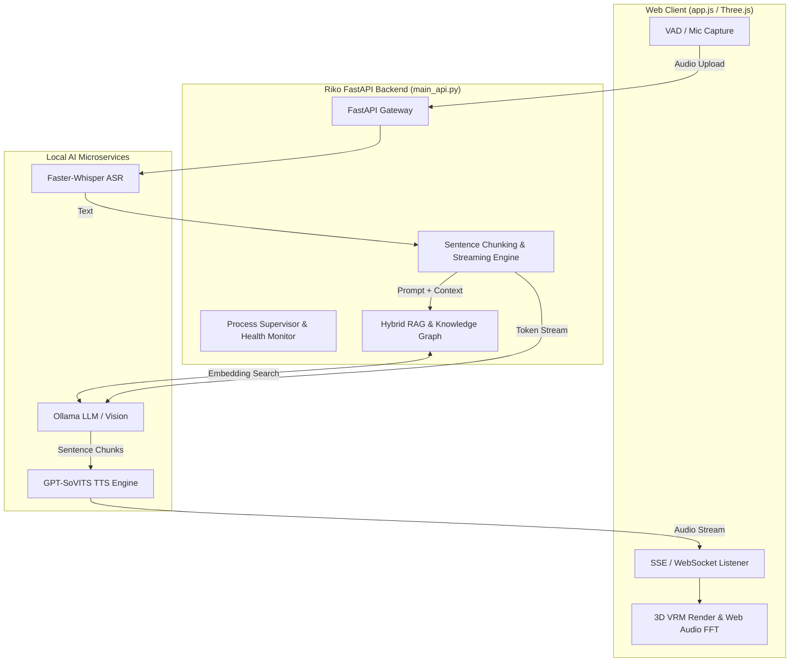

# 🚀 Future Development Roadmap for Project Riko

This document outlines next-generation feature proposals and technical architecture upgrades for Project Riko across **System Orchestration**, **Real-Time Streaming**, **Voice Synthesis**, **Memory Architecture**, **3D Avatar Rendering**, and **Desktop Integration**.

---

## 🏗️ Architecture Blueprint

---

## 1. ⚡ Real-Time Streaming & Low-Latency Pipeline

Currently, `/api/chat` processes the full LLM completion and generates TTS audio for the entire text before returning a JSON payload. Upgrading to real-time streaming will cut perceived latency from ~3-5 seconds down to **< 500ms**.

### Key Improvements:
* **Server-Sent Events (SSE) / WebSocket Streaming:**
  * Stream tokens from Ollama to the browser in real-time as they are generated.
  * Render text letter-by-letter on the client chat bubble.
* **Sentence-Level Audio Generation:**
  * Split LLM output streams by sentence delimiters (`.`, `!`, `?`, `~`).
  * Send each sentence to GPT-SoVITS immediately so voice playback begins on sentence 1 while sentence 2 is still generating.
* **Pre-Synthesized Expression Audio Cache:**
  * Cache common short vocalizations (*"Senpai!"*, *"Baka!"*, *"Hmm..."*, *"Hehehe"*) in a local audio cache to play instantly upon user submission.

---

## 2. 🧠 Memory & Cognitive Upgrades (`server/memory.py`)

| Feature | Description | Implementation Details |
| :--- | :--- | :--- |
| **Hybrid RAG Vector Store** | Replace flat JSON lists with embedding-backed memory. | Use `sqlite-vec` or `chromadb` with Ollama embeddings (`nomic-embed-text`) to dynamically query relevant facts for each prompt turn. |
| **Knowledge Graph Memory** | Store relationships between entities. | Extract triples `(Subject, Relation, Object)` (e.g. `User -> likes -> Python`) to enable relational reasoning across conversations. |
| **Episodic Conversation Search** | Search through past conversation logs by date or topic. | Index `chat_history.json` turns so the user can ask *"What did we talk about last Tuesday?"*. |

---

## 3. 🎭 3D Avatar & Visual Experience (`server/static/app.js`)

* **FFT Web Audio Lip-Sync (Visemes):**
  * Connect `HTMLAudioElement` to an `AudioContext` `AnalyserNode`.
  * Calculate real-time frequency energy spectrum to dynamically set `currentVRM.expressionManager` morph weights (`aa`, `ih`, `ou`, `ee`, `oo`) based on audio pitch and volume.
* **Eye Gaze & Mouse Tracking:**
  * Map screen cursor `(x, y)` to VRM bone lookAt targets so Riko follows the cursor smoothly with her eyes and head.
* **Interactive Touch / Animations:**
  * Click interactions on the 3D canvas (e.g. head patting triggers a happy expression and blushing animation).
  * Custom idle animations (breathing cycle, natural blinking, slight body swaying).
* **3D Environments & Post-Processing:**
  * Replace the static canvas background with 3D GLTF anime room environments and Three.js bloom filters.

---

## 4. 🎛️ System Supervision & Multi-Persona Management

* **Unified Process Supervisor (`run_all.py`):**
  * Auto-recover crashed microservices (Ollama, GPT-SoVITS).
  * Expose real-time CPU/GPU memory and server metrics on the UI status bar.
* **Dynamic Persona Hot-Swapping:**
  * Switch between distinct character presets (`Riko`, `Tsundere Companion`, `Cool Assistant`) live from the UI without restarting the server.
  * Support custom `.vrm` avatar model selection per preset.

---

## 5. 👁️ Vision, Multimodal & Tool Support

* **Screen & Vision Integration:**
  * Add a snapshot / camera toggle button.
  * Use multimodal Ollama models (e.g., `llama3.2-vision`) so Riko can view screenshots, code snippets, or artwork provided by the user.
* **Local System Tool Execution:**
  * Enable Ollama function calling for checking local weather, setting system timers, controlling media playback, or searching the web locally.

---

## 6. 🖥️ Desktop Widget / Overlay Mode

* **Tauri / Electron Desktop App:**
  * Wrap the frontend in a borderless, transparent desktop window.
  * Allow "Always-on-Top" mode so Riko sits gracefully on your desktop background while you work or play games.

---

## 7. 🎨 Layout & UI/UX Design Concepts

* **Glassmorphic Immersion Mode (Full 3D Stage):**
  * Expand the 3D VRM stage to fill the entire viewport background with dynamic particle effects (sakura petals / ambient glow).
  * Make the chat messages float on the left in a sleek frosted glass container (`backdrop-filter: blur(16px)`).
* **3-Column Companion Dashboard:**
  * **Left Sidebar (Knowledge & Mood):** Live Affection & Mood meters, Knowledge Graph facts list, and quick persona switcher.
  * **Center Column (Chat):** Main conversational feed with Markdown rendering and collapsible reasoning boxes.
  * **Right Column (3D Stage):** Dedicated high-FPS avatar viewport with camera presets (Close-up, Waist-up, Full-body) and 3D background room selector.
* **Quick Reaction Action Bar & Radial Menu:**
  * Add quick interactive pill buttons below the chat input bar (*"Headpat"*, *"Poke"*, *"Ask Mood"*, *"Compliment"*).
  * Right-clicking Riko's 3D avatar opens a circular radial menu for instant interactions.
* **Dynamic Time-of-Day & Live Weather Background Stage:**
  * Auto-sync 3D background lighting and skybox to your local time (Morning, Golden Sunset, Rainy Night, Starlit Sky).
* **Split-Screen Pair-Programming & Code Studio Mode:**
  * Split interface into a Code Editor panel (with syntax highlighting and diff review) and Riko's avatar observing code to give real-time suggestions and bug fixes.
* **3D Wardrobe & Room Customizer Drawer:**
  * Outfit swapper (School Uniform, Hoodie, Glasses, Ribbons) and 3D room decoration prop placement.
* **Live Neon Audio Waveform & Spatial Audio Glow:**
  * Dynamic audio spectrum visualizer ring glowing around Riko's 3D pedestal while speaking.
* **Gamified Friendship & Pomodoro Study Timer (RPG Mode):**
  * Relationship XP meter, conversation streak milestones, and a built-in Pomodoro focus timer where Riko encourages you during study/work sessions.
